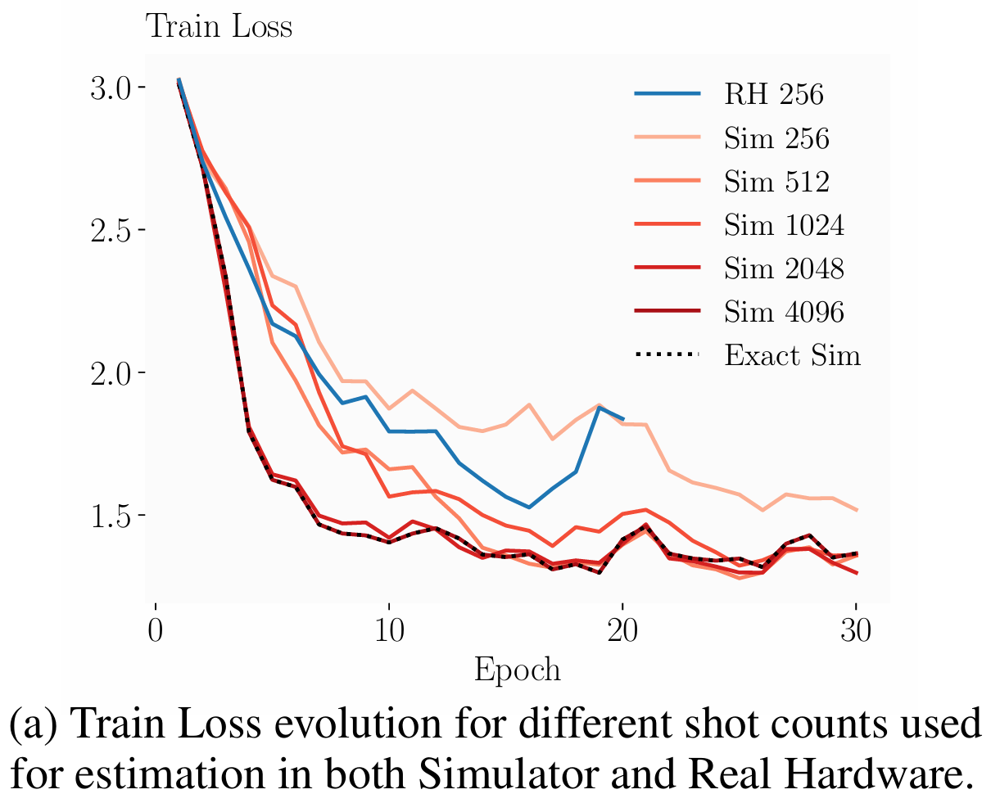
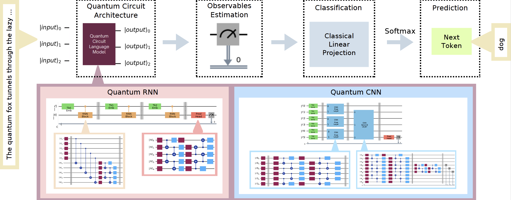

# Practical Hybrid Quantum Language Models with Observable Readout on Real Hardware

This repository contains the official implementation of the paper:

[**Practical Hybrid Quantum Language Models with Observable Readout on Real Hardware [ArXiv, 2025]**](LINK_TO_YOUR_ARXIV_PAPER_HERE)

---

## 📌 Overview

This work introduces **Hybrid Quantum Language Models (HQLMs)**, a framework for training generative sequence models on Noisy Intermediate-Scale Quantum (NISQ) devices. By moving away from bitstring sampling and utilizing estimator-based readout, we demonstrate the first end-to-end training of quantum language models on real hardware.

We introduce and evaluate two hardware-efficient architectures:
- **QRNN** &mdash; Quantum Recurrent Neural Networks: Utilizing a recurrent PQC block with heavy-hex optimized connectivity.
- **QCNN** &mdash; Quantum Convolutional Neural Networks: Utilizing parallel convolutional PQC blocks with pooling for hierarchical feature extraction.

---

### 📈 Key Results

Our models achieve competitive performance with classical baselines on synthetic language tasks and demonstrate robustness to hardware noise when trained with our hybrid strategy.

<!-- *(Training Loss Evolution on IBM Hardware vs. Simulator)* -->

<!--  -->

<figure>
    
    <figcaption><strong>Figure 7(a):</strong> Train Loss evolution for different shot counts</figcaption>
</figure>

Key achievements include:
* **End-to-End Hardware Training:** Successful optimization of generative models on IBM Eagle/Heron processors.
* **Competitive Perplexity:** QRNN and QCNN match the perplexity of classical RNNs on toy datasets in simulation.
* **Noise Resilience:** Effective learning with as few as 256 shots per circuit evaluation.

---

### 📚 Methods

#### Hybrid Observable Readout

Instead of sampling bitstrings (which is non-differentiable and noisy), we extract continuous features measuring expectation values of local observables ($Z$ and $ZZ$):

$$
f_{\theta}(x) = \langle \phi(x) | U^{\dagger}(\theta) \hat{O} U(\theta) | \phi(x) \rangle
$$

These features are mapped to next-token probabilities via a classical linear projection, allowing for smooth gradient flows.

<figure>
    
    <figcaption><strong>Figure 1:</strong> Hybrid Quantum Language Model (HQLM) pipeline — token embedding into quantum states, processing via QRNN/QCNN layers, and observable readout using ⟨Z⟩ and ⟨ZZ⟩ expectations.</figcaption>
</figure>

#### Hardware-Efficient Circuits

We design specific circuit topologies adapted for the **IBM Heavy-Hex** lattice to minimize SWAP operations and circuit depth:

* **QRNN:** Uses a recurrent block with distinct Embedding ($\mathcal{E}$) and Hidden ($\mathcal{H}$) registers.
* **QCNN:** Uses localized convolutional blocks ($\mathcal{U}_{conv}$) and pooling to process tokens in parallel.

<!--  -->
<!-- *> [Note: Insert Figure 9 or 11 here to illustrate hardware mapping]* -->

#### Training Strategy

We employ a scalable hybrid optimization loop:
* **Quantum Parameters:** Trained via **Multi-sample SPSA** (Simultaneous Perturbation Stochastic Approximation) to estimate gradients on noisy hardware.
* **Classical Head:** Trained via exact gradient descent (Backpropagation).

---

## Getting Started

### 🔧 Environment Setup

Setup a Conda Environment:

```bash
conda create -n qlms python=3.10
conda activate qlms
pip install -r requirements.txt
```

**Requirements:**
This codebase relies on `PyTorch` for the classical backend and `Qiskit` for quantum simulation and hardware execution.

### 💾 Datasets

The repository includes the synthetic datasets used in this paper as `.txt` files under `data/`. The generation script for the TS-LM dataset is `generate_ts_data.py`.

---

### 🚀 Examples

#### 1. Simulation Training

To train a **QRNN** on the TS-LM task using the Qiskit Aer statevector simulator:

```bash
python train.py --model qrnn --dataset TS-LM --seed 123 --max_batches 10 \
    --epochs 20 --save_model --batch_size 8
```

To train a **QCNN** on the Meaning Classification (MC) task:

```bash
python train.py --model qcnn --cnn_type 33 --dataset TS-LM --seed 123 --max_batches 10 \
    --epochs 20 --save_model --batch_size 8
```

#### 2. Real Hardware Execution

To run training or evaluation on **IBM Quantum** hardware (requires valid IBM Quantum Token):

```bash
# Make sure to add your IBM credentials inside the setup_qiskit_ibm_runtime() function in train.py

# Example training usage
python train.py --model qrnn --dataset TS-LM --seed 123 --max_batches 10 \
    --epochs 20 --save_model --batch_size 8 --backend ibm_brussels --shots 512

# Example eval usage
model="path_to_model"
python eval.py --model qrnn --dataset TS-LM --load_model $model \
    --backend ibm_brussels --shots 512 --batch_size 32 --max_batches 10 
```

## 📖 Citation

If you find our work useful, please cite our paper:

```bibtex
@article{balauca2025practical,
  title={Practical Hybrid Quantum Language Models with Observable Readout on Real Hardware},
  author={Balauca, Stefan and Balauca, Ada-Astrid and Iftene, Adrian},
  journal={arXiv preprint},
  year={2025}
}
```